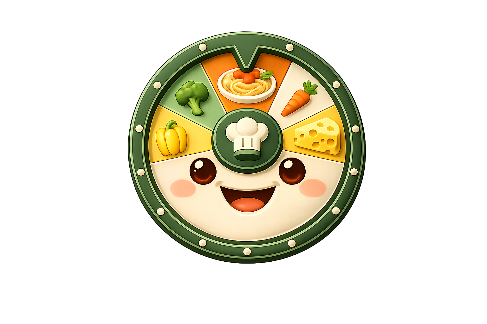
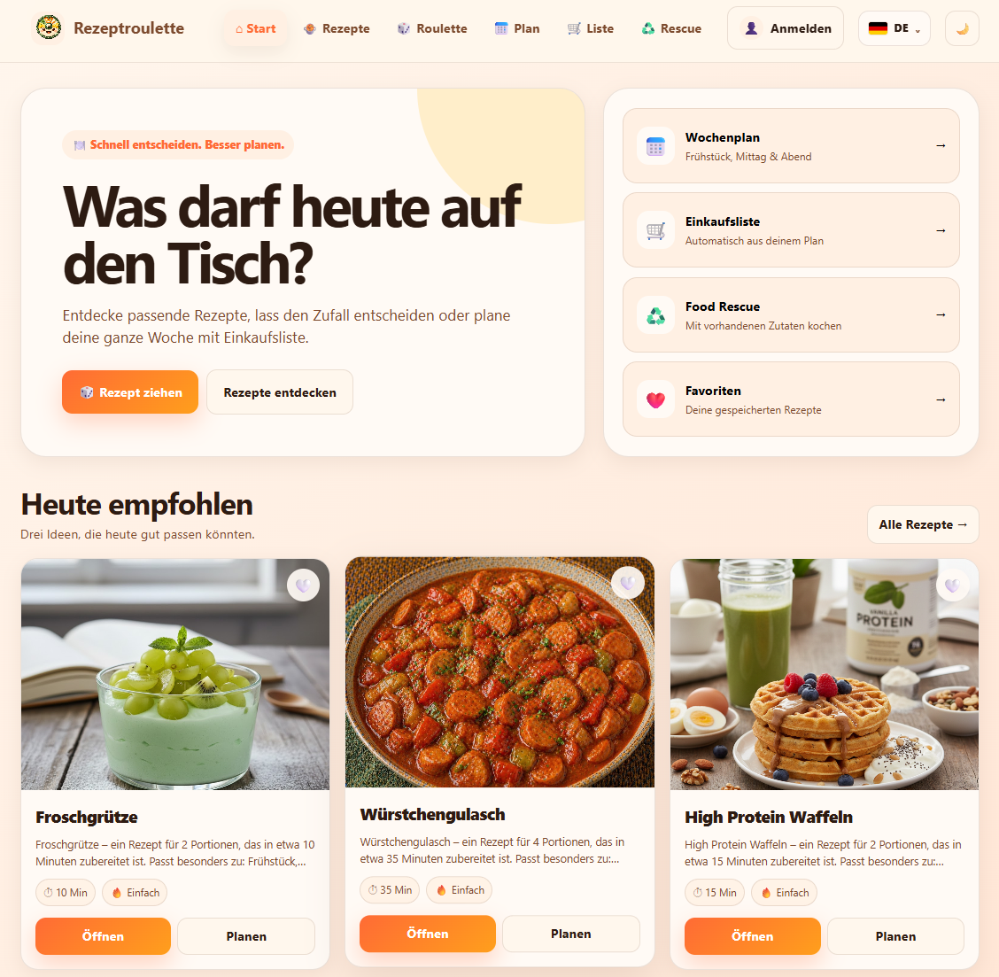
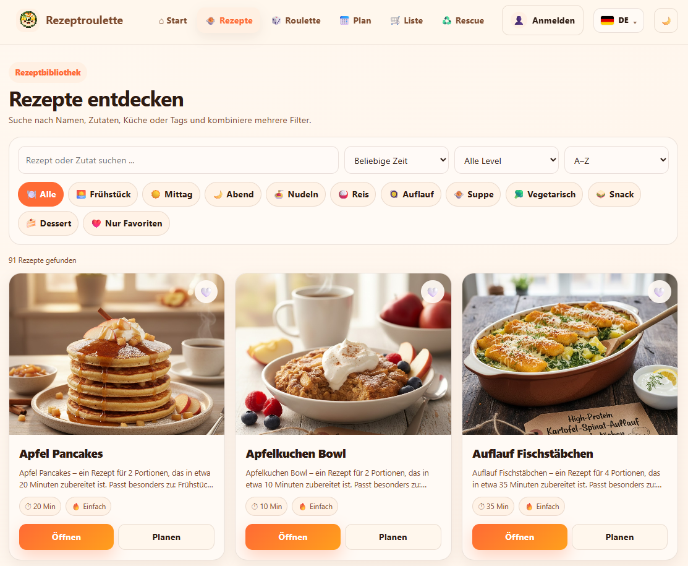
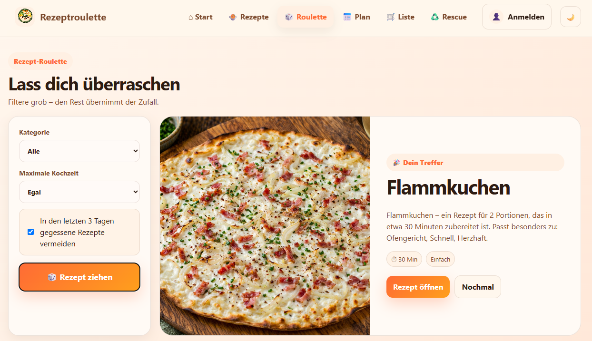
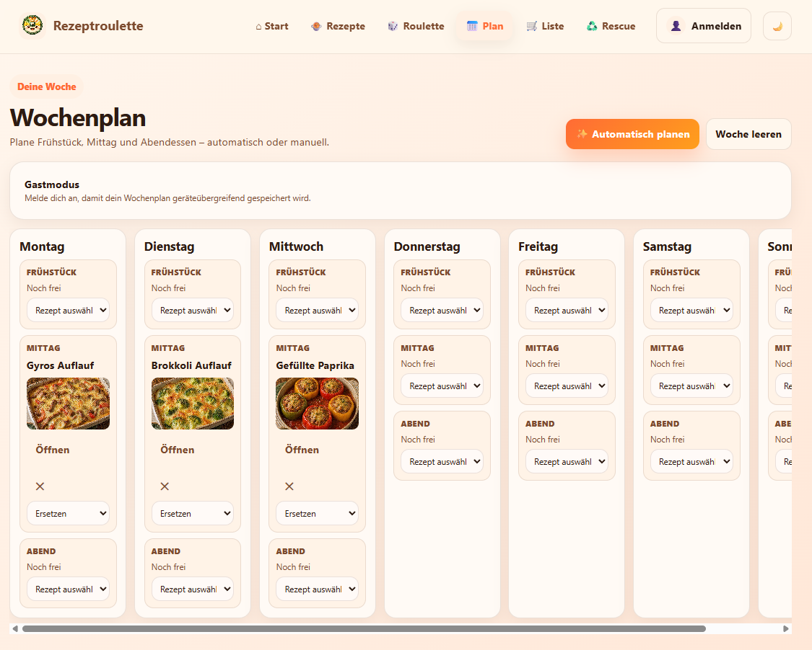
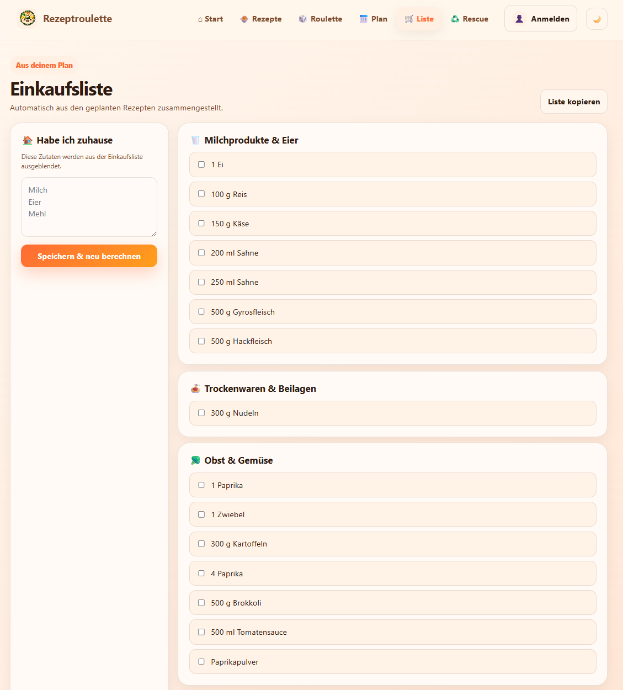
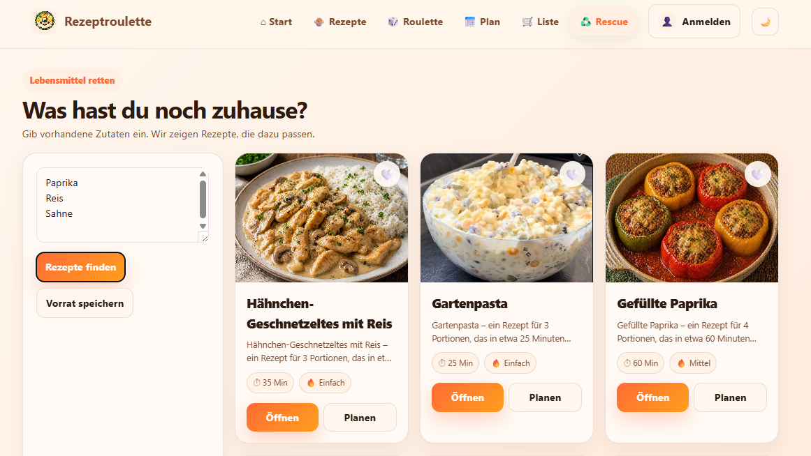

<h1>
  
  RezeptRoulette
</h1>


[](https://rezeptroulette-1.onrender.com/)

### Your solution to the everyday question: "What should I eat today?"

RezeptRoulette is a web application designed to make meal planning easier and help users discover new recipes.

It combines recipe discovery, random meal suggestions, weekly meal planning, shopping lists, and ingredient-based recipe recommendations in one application.

---

## 🖼️ Preview



---

## ✨ Features

- 🎲 **Recipe Roulette** – Get a random recipe suggestion when you don't know what to cook
- 🔍 **Recipe Discovery** – Browse and discover available recipes
- 🎛️ **Recipe Filters** – Filter recipes by category, preparation time, difficulty, favorites, and more
- 📅 **Weekly Meal Planner** – Plan breakfast, lunch, and dinner for the entire week
- 🛒 **Smart Shopping List** – Generate a shopping list based on your planned meals
- ♻️ **Food Rescue** – Find recipes based on ingredients you already have at home
- ❤️ **Favorites** – Save your favorite recipes for quick access
- ⭐ **Recipe Ratings** – Rate recipes and keep track of meals you enjoy
- 🌙 **Dark Mode** – Switch between light and dark themes

---

## 🛠️ Tech Stack

| Area | Technology |
|---|---|
| **Backend** | Python, FastAPI |
| **Frontend** | HTML5, CSS3, JavaScript |
| **Database** | SQLite |
| **API** | REST API |
| **Deployment** | Render |
| **Version Control** | Git & GitHub |

---

## 📸 Application Preview

### 🔍 Recipe Discovery

Search and filter recipes by category, preparation time, difficulty, favorites, and more.



### 🎲 Recipe Roulette

Can't decide what to cook? Recipe Roulette randomly selects a recipe based on your preferences.



### 📅 Meal Planning & Shopping

Plan breakfast, lunch, and dinner for the entire week. The shopping list helps organize the ingredients needed for your planned meals.

<p>
  
  
</p>

### ♻️ Food Rescue

Enter ingredients you already have at home and discover recipes that match your available ingredients.



---

## 🚀 Live Demo

RezeptRoulette is deployed and available online.

👉 **[Try RezeptRoulette Live](https://rezeptroulette-1.onrender.com/)**

> **Note:** The application is hosted on Render. The first request may take a few seconds if the service is currently inactive.

---

## 📂 Project Structure

```text
Rezeptroulette/
├── bilder/              # Recipe images
├── data/                # Application data
├── docs/
│   └── screenshots/     # README screenshots
├── services/            # Application services
├── static/              # Frontend assets
├── api.py               # API and FastAPI application
├── app.py               # Application logic
├── config.py            # Application configuration
├── database.py          # Database access
├── main.py              # Application entry point
├── models.py            # Data models
├── requirements.txt     # Python dependencies
└── README.md            # Project documentation
```

---

## ⚙️ Local Installation

### Prerequisites

Make sure Python is installed on your system.

### 1. Clone the repository

```bash
git clone https://github.com/Pexiz96/Rezeptroulette.git
```

### 2. Navigate to the project directory

```bash
cd Rezeptroulette
```

### 3. Create a virtual environment

```bash
python -m venv .venv
```

### 4. Activate the virtual environment

**Windows**

```bash
.venv\Scripts\activate
```

**macOS / Linux**

```bash
source .venv/bin/activate
```

### 5. Install the dependencies

```bash
pip install -r requirements.txt
```

### 6. Start the application

```bash
python -m uvicorn api:app --reload
```

### 7. Open RezeptRoulette

Open your browser and navigate to:

```text
http://127.0.0.1:8000
```

The application should now be running locally.

---

## 🗺️ Roadmap

RezeptRoulette is continuously being developed and improved.

Planned improvements include:

- [ ] Improve the user experience and responsive design
- [ ] Expand and improve recipe recommendations
- [ ] Improve recipe filtering
- [ ] Optimize performance and loading times
- [ ] Further improve mobile usability

---

## 🎯 Project Goals

The goal of RezeptRoulette is to simplify the everyday process of deciding what to cook and planning meals.

Instead of focusing on only one feature, the application combines several useful tools into one workflow:

**Discover recipes → choose a meal → plan the week → organize ingredients → create a shopping list**

The project is also an opportunity to continuously improve my skills in:

- Full-stack web development
- Python development
- REST API development
- Frontend development
- Database design
- Application architecture
- Git and version control
- Deployment of web applications

---

## 💡 Motivation

The idea behind RezeptRoulette came from a simple everyday problem:

**"What should I eat today?"**

Instead of repeatedly searching for meal ideas, RezeptRoulette provides inspiration and combines recipe discovery with practical planning tools.

The project has grown from a simple recipe idea into a web application with multiple interconnected features.

---

## 🤝 Feedback

Feedback, suggestions, and ideas for improving RezeptRoulette are welcome.

If you discover a bug or have an idea for a new feature, feel free to open an issue in this repository.

---

## 👨‍💻 Author

Developed by **Pexiz96**

This project is part of my software development portfolio and is continuously being improved and extended.

---

⭐ If you like the project, feel free to give the repository a star!
