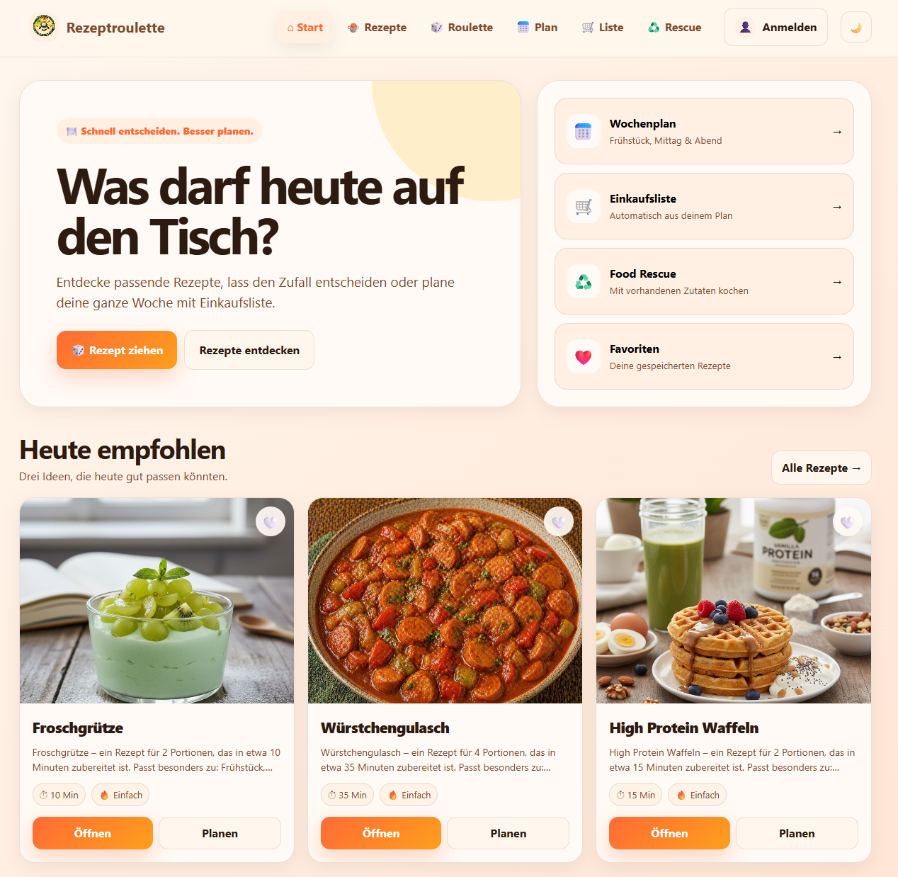

# 🍽️ RezeptRoulette

### Your solution to the everyday question: "What should I eat today?"

RezeptRoulette is a web application designed to make meal planning easier
and help users discover new recipes.

It provides features for finding meal inspiration, planning meals,
organizing recipes, and creating shopping lists.

## 📸 Preview

